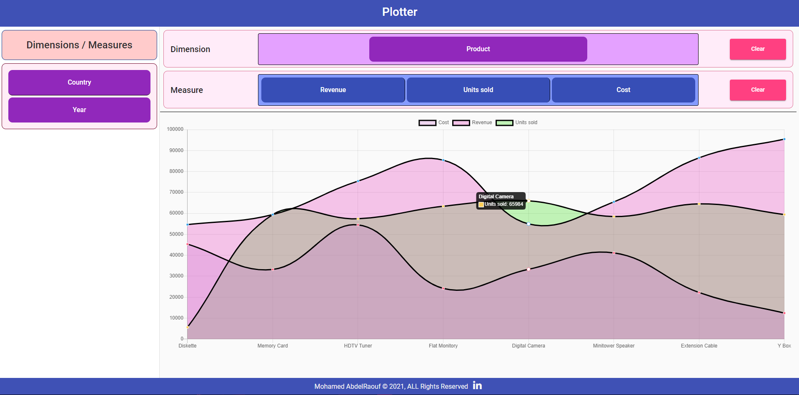

# Plotter Application



A Plotter application where the customers can discover all the columns available in a data source. And based on their business need, draw a line-chart of a measure in correspondence to a dimension. 

* The measure values are represented on the Y-
Axis of the chart

* The Dimension values are represented on the X-Axis of the chart.

<hr>

## Highlights

- ### Charts Library
    I used ``` ng2-chart ``` a beautiful charts Library for Angular2 based on Chart.js

- ### Drag / Drop Widget
    I used ``` Angular Material Drag and drop CDK ``` 

<hr>
